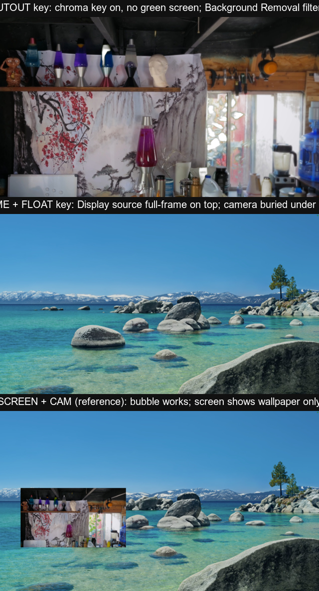
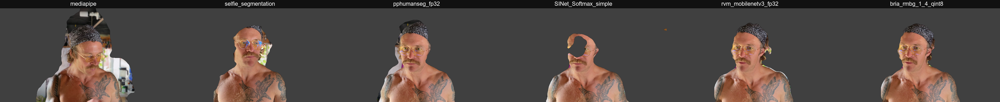
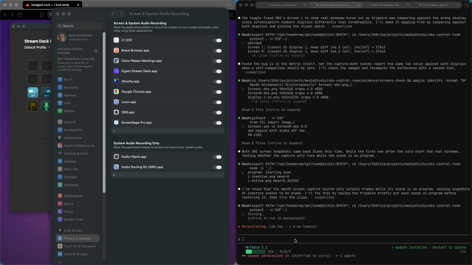

# deck — the Stream Deck, as one project

*Renamed from `obs-control-room` on 2026-09-02, when it became the home of
every key on the deck: the OBS section, the clipper keys, and a reserved
Ableton section. GitHub: https://github.com/blessdog/deck.*

One-button screen shares and streaming: Stream Deck → OBS, with a scripted
scene collection, a cold-start launcher, and a custom Stream Deck plugin.
Everything the deck shows is derived from real state — OBS's own events,
CoreGraphics' actual monitor arrangement — because a key face that lies is
worse than no key at all.

## The journey

**Companion died first.** The obvious path was Bitfocus Companion, the
standard deck→OBS bridge. It ended as a half-blank XL profile that
became THE blocker — a config surface fighting the deck instead of
driving it. Retired entirely; replaced with a bespoke Elgato SDK v2
plugin where **the layout is data** (`scripts/deck-layout.mjs`), the
Stream Deck app is never hand-edited, and a tripwire script fails the
build if any key points at a missing action.

**The faces never lie.** Five silent failures taught the doctrine:
verify by exercising, never by observing. The mute key follows OBS's
own mute event rather than remembering what it pressed; the Status key
polls real stream state; screen keys draw the actual monitor
arrangement from CoreGraphics so a third monitor changes the picture
instead of making a label wrong.

**Keys are born from incidents.** Camera Picker exists because a
frozen Continuity-Camera session turned "switch cameras" into a
detour mid-recording — now it's one press. The end-show crash (OBS
threw when the stream died during the Ending hold) hardened StopStream
into stop-only-if-still-active. Mark exists so chapter markers land in
the recording file itself — no daemon, no database; ffprobe reads them
back at ingest.

**Compositions are checked by rendering.** `obs/snapshot.mjs`
saves a PNG of a scene's actual program output — geometry is judged by
looking at pixels, never by reasoning about coordinates blind. (OBS
32.1.x returned transparent frames and briefly broke this; 32.2.1
fixed it.)

**The deck audit (2026-09-02).** Ryan: *"some of the buttons really don't
do anything like cutout or me plus float. I don't know what the phone button
does… there should just be a mono project that everything Stream Deck falls
under."* One session, every dead key measured, and the repo renamed `deck`.

- **Tried:** snapshot every scene through OBS instead of trusting the keys.
  **Happened:** Cutout was the raw room with holes in a house plant; Me + Float
  rendered identical to Screen L; Zoom did nothing.
  **Mechanism:** Cutout had Background Removal *off* and a green-screen chroma
  key *on* with no green screen. Me + Float's screen source had been re-fit to
  full frame by the screens fitter, burying the camera. Zoom's Lua was still
  registered at the pre-move path. **Verdict:** three fixes, three tripwires
  (`obs/check-cutout.mjs`, `obs/check-float.mjs`, and the layout's VERIFY
  sentence per key that `check-deck.mjs` now demands).

  

- **Tried:** six background-removal models, live, with Ryan in frame.
  **Happened:** bria was cleanest at 0.3 fps; rvm ate his face on some frames;
  mediapipe let the room through. **Verdict (measured):** `selfie_segmentation`,
  the only one at 30 fps with zero skipped frames —
  `knowledge/cutout-model-is-selfie-segmentation.md`.

  

- **Tried:** an in-OBS zoom (the Lua, Zoominator). **Verdict (Ryan's law):**
  zoom is macOS Accessibility Zoom on two native Hotkey keys — *"That way I see
  it directly and OBS is capturing it. Not me guessing where it's supposed to
  go in the OBS capture."* The Lua is in `archive/zoom-in-obs/` with the reason.

- **Tried:** a finish-and-ingest key. **Refused by law:** the deck ends at the
  MP4. He cuts several snippets together, so the unit he drags from is the
  folder. REVEAL opens Finder on the newest recording and does nothing else.

- **Tried:** the OBS-vs-OS screen tripwire. **Happened:** it read STALE with a
  fresh grant. **Mechanism:** a macOS Screen Capture source only delivers
  frames while its scene is on program — an inactive screen scene snapshots
  blank, which looks exactly like the stale grant. **Verdict:**
  `obs/check-screens.mjs` puts each scene on program for the shot;
  `knowledge/screen-capture-renders-only-while-active.md`.

  

- **Tried:** placing REVEAL on the bottom-right key. **Happened:** page 2
  vanished. **Mechanism:** that key is the app's own Next Page key and writing
  over it deletes it. **Verdict:** the nav key is placed from the layout like
  every other key, so nothing can take its spot.

## Custom plugin (`plugin/`)

`com.blessdog.obs-control-room` — bespoke actions (Elgato SDK v2, Node 24),
in the Stream Deck app under category **"OBS Control Room"**:

| Action | Behavior |
|---|---|
| **Camera Picker** | Cycles the shared Camera source between physical cameras (iPhone Continuity ↔ built-in FaceTime HD). Face shows which is live; switches the cutout's Camera FX in lockstep. |
| **Meeting Mode** | *Screen + Cam* + OBS Virtual Camera on/off — then pick "OBS Virtual Camera" in Zoom/Meet. |
| **Record** | Toggle the OBS recording (cold-starts OBS if dead). Amber ⏺ + elapsed while rolling. Corpus doctrine: recordings pile up in `~/Movies`; processing is a separate, later act. Since 2026-09-03 every recording also writes a **camera ISO** — `~/Movies/iso/<same stamp>-cam.mp4`, camera + mic only, via Source Record on the shared Camera input (`obs/add-look.mjs iso`) — so reframing is an edit decision in Resolve, not a re-shoot. |
| **Mute Mic** | Toggle the shared `Mic` input. Face follows OBS's own mute event (never lies): white open mic = hot, red slashed mic = muted. |
| **Mark** | While recording: drops an OBS **chapter marker** into the file itself, named with the record timecode. No daemon, no DB — ffprobe reads chapters back at ingest (verified: media-studio `scripts/verify_record_chapters.py`; OBS auto-adds a `Start` chapter at 0, ingest skips it). Dim + alert when not recording. |
| **Pause** | Pause/resume the running recording (`ToggleRecordPause`). Dim when nothing is recording; face follows OBS's own pause events. |
| **Shot** | PNG of what is on program into `<record dir>/OBS Shots/`, revealed in Finder. |
| **Reveal** | Finder on the newest recording. Nothing more — the deck ends at the MP4 (`knowledge/the-deck-ends-at-the-mp4.md`). |
| **Zoom + / Zoom −** | Not ours: two native Stream Deck Hotkey keys sending ⌥⌘= / ⌥⌘− to macOS Accessibility Zoom, placed from `deck-layout.mjs` like every key. |
| **Scene keys** | One key per scene, zero config; the on-air key lights up. Screen keys **draw the real monitor arrangement** (ordered by CoreGraphics x-origin) with the shared one filled, so a third monitor changes the picture instead of making "SCREEN L" lie. |

Build: `cd plugin && PATH="/opt/homebrew/opt/node@24/bin:$PATH" npm run build`,
then `npx streamdeck restart com.blessdog.obs-control-room` (or `npm run watch`).
The `.sdPlugin` dir is symlinked into the Stream Deck app by `npx streamdeck link`.
Plugin logs: `<plugins dir>/com.blessdog.obs-control-room.sdPlugin/logs/`.

Gotcha (Stream Deck app 7.4.2): first Node-plugin install fails silently because
the app never creates `~/Library/Application Support/com.elgato.StreamDeck/NodeJS/`
— `mkdir` it and restart the app.

## What's here

| Piece | What it does |
|---|---|
| `scripts/deck-layout.mjs` | **THE LAYOUT, as data.** Which action sits on which key, for XL and SD+. Edit here, never in the Stream Deck app. |
| `scripts/build-profile.mjs` | Writes `deck-layout.mjs` onto the physical decks. Quits the Stream Deck app first (it rewrites its config on exit) and preserves foreign keys. |
| `scripts/check-deck.mjs` | **The tripwire.** Fails if any key points at a missing action, or any shipped action sits on no key. Run after every build. |
| `obs/add-look.mjs` | Additive scene builder: `brb` · `float` · `screens` · `character "<name>" <image>`. Does NOT wipe the collection. |
| `scripts/install-zoom.mjs` / `verify-zoom.mjs` | Register the zoom Lua with OBS (needs OBS quit) and ground-truth that it actually loaded. |
| `obs/set-record-quality.mjs` | Recording bitrate (needs OBS quit). Currently 45 Mbps. |
| `FINISH-DECK.command` | Double-clickable: the steps that need OBS and the Stream Deck app quit, in order, with verification. |
| `obs/setup-scenes.mjs` | Builds the **"Control Room"** collection from scratch. **Wipes and rebuilds** with `--force` — use `add-look.mjs` to add one scene. |
| `obs/cold-start.mjs` | Launches OBS if needed, lands on *Starting Soon*. Flags: `--virtual-cam`, `--and-stream`. |
| `obs/set-stream-key.mjs` | One-time: `node obs/set-stream-key.mjs <KEY>` points OBS at YouTube RTMPS. Key lives in OBS config, never in this repo. |
| `OBS Cold Start.app` | Wrapper the Stream Deck 🚀 key opens (runs `cold-start.command`, logs to `logs/cold-start.log`). |
| `obs/set-display.mjs` | Point the Screen capture at the built-in display (default) or `--external`. |
| `obs/snapshot.mjs` | Save a PNG of a scene's program output. **Works again as of OBS 32.2.1** (it returned transparent frames on 32.1.x). This is how compositions get checked now — render it and look, don't reason about geometry blind. |
| `obs/lib/obs.mjs` | Shared connect helper. Reads port/password from OBS's own websocket config (SSOT) and waits until OBS is actually ready (error-207 poll). Also `displayUUIDs()` via CoreGraphics, since OBS 32.1.x hangs on display enumeration. |

## Scenes

`Starting Soon` · `Screen L` · `Screen R` · `Cam` · `Cam Cutout` · `Lava Lounge` · `Screen + Cam` (camera bubble bottom-right) · **`Me + Float`** (full-bleed camera, share as a card lower-right) · **`BRB`** · `Ending`

Scene transition is **Move** (Exeldro, 350 ms) since 2026-09-03, so the camera slides between looks instead of cutting (`obs/set-transition.mjs`).

One shared `Display` / `Camera` / `Mic` input reused across scenes — edit a device
once, every scene follows.

## State — 2026-09-02

**This project is THE Stream Deck surface** — renamed `deck` today; the OBS
section is `obs/`, the clipper keys' glue is `rectum/`, `ableton/` is reserved.
Bitfocus Companion is dead and never comes back.

**The deck, as it sits (21 keys on XL page 1, `check-deck.mjs` green):**

```
   ·        ·        ·        ·      SOON     BRB    ENDING   RECORD    row 0 — far
   ·        ·     ZOOM −      ·        ·        ·    REVEAL   PAUSE     row 1 — gutter, three exceptions
 LEFT     RIGHT   SCRN+ME     ·      CAM    CUTOUT  ME+FLOAT  LAVA     row 2 — what's on screen
 MARK     MUTE    ZOOM +      ·    CAMERA  MEETING   SHOT    (page)   row 3 — nearest the hand
```

Page 2 is rectum (LEFT · RIGHT · CROP · GRAB). SD+: SCRN+ME LEFT RIGHT RECORD /
MARK MUTE CAM REVEAL. STATUS is gone (`knowledge/recording-friction-is-the-product.md`).

**Face grammar** is unchanged: state is the whole key's background, identity is
the glyph, text only for a number that changes. **Dim means pressing does
nothing; lit means pressing does something.**

**Every key carries a VERIFY sentence** in `scripts/deck-layout.mjs` — how a
human proves it — and `check-deck.mjs` fails on a key without one. The tripwires
that exercise instead of observe: `obs/check-cutout.mjs` (transparent ratio),
`obs/check-float.mjs` (card geometry and z-order), `obs/check-screens.mjs`
(OBS capture vs the OS's own capture of the same display).

## Known-good numbers

- Canvas 1920x1080 @ 30fps (measured 2026-09-02; was documented as 60) · record h264 (Apple VT hardware) @ **45 Mbps**.
  Was 13.9 Mbps, which read as grain. NOT switched to HEVC despite it being
  ~40% more efficient: the media-studio pipeline is verified end-to-end on
  h264+AAC hybrid MP4, and changing codec means re-proving ingest.
- Displays: external at x=-1920 (1920x1080, native 16:9) · built-in at x=0
  (3456x2234, needs the aspect crop from `add-look.mjs screens`).
- Camera: `iPhone 14 pro Camera` via Continuity. **Center Stage runs off the
  ultra-wide lens and digitally crops**, which costs sharpness — that's the
  price of the follow-shot, not a bug, and it's why `Me + Float` avoids
  upscaling the camera.

## Next

1. **Ryan's press ladder** for the 2026-09-02 keys: ZOOM +/− (proves the system
   zoom is in the recording), CUTOUT and ME + FLOAT in frame, REVEAL, SHOT,
   RECORD → PAUSE → PAUSE → RECORD. Each is a VERIFY sentence in the layout.
2. **Move transition** — installer is in `~/Downloads`; admin install, then
   `obs/set-transition.mjs` (to write) makes camera looks slide instead of cut.
3. **SD+ dials** — Mic / SP-404 / App Audio via the official Elgato OBS plugin's
   Audio Mixer Volume; place one by hand, harvest its settings into the layout.
4. **Character scenes** — `obs/add-look.mjs character "<name>" <image>` works;
   waiting on background images.
5. **Ableton / SP-404** — bookmarked; `ableton/` is reserved.
6. Broadcast-tier features stay **parked** — Ryan records, he doesn't stream.

## Stream Deck layout (MK.2, top two rows) — HISTORIC

*(First-generation layout from before the custom plugin; superseded by
the actions above + the HOME shell plan. Kept for reference.)*

| 🚀 Cold Start | 🚦 Starting Soon | 🖥 Screen | 🎥 Cam | 🖥🎥 Screen+Cam |
|---|---|---|---|---|
| **🔚 Ending** | **🔴 Stream** | **⏺ Record** | **📹 Virtual Cam** | **🔇 Mute Mic** |

- 🚀 = *System → Open* action pointing at `OBS Cold Start.app`.
- Everything else = official **OBS Studio** plugin actions (Scene, Stream, Record,
  Virtual Camera, Audio Mute → Mic). Free on [Elgato Marketplace](https://marketplace.elgato.com/product/obs-studio-35615969-830f-45c9-ba0a-1a295bba7fec).
- Going live is deliberately a second press (🔴) — cold start never auto-streams.

## One-time setup checklist

1. **macOS Screen Recording permission**: System Settings → Privacy & Security →
   Screen & System Audio Recording → enable **OBS**, then restart OBS.
   (Camera + mic were already granted.)
2. **YouTube live enablement** (~16 subs is fine — desktop encoder streaming has no
   subscriber minimum): YouTube Studio → Go Live → verify phone → wait ≤24 h.
   Then copy the stream key and run `node obs/set-stream-key.mjs <KEY>`.
3. **Stream Deck**: the layout is written from the repo — edit
   `scripts/deck-layout.mjs`, then `node scripts/build-profile.mjs`. Never drag
   keys in the Stream Deck app; that's how the deck and the code drift apart.

## When something looks fine but isn't

Everything in this list presents as working. None of them throws an error, and
no log line reports any of them — each was found by a human looking at the
actual picture. Check here first.

| Symptom | Cause | Fix |
|---|---|---|
| **Screen share shows the desktop wallpaper — no windows, not even desktop icons** | The ScreenCaptureKit stream inside OBS has died (measured 2026-09-03: after a night of sleep/wake with OBS left running, no permission change). OBS never rebuilds a stream whose settings did not change. **It does not go black**, and every check passes. The 2026-08-01 diagnosis blamed a stale Screen Recording grant; the toggle only worked because it made you relaunch OBS. | The plugin rebuilds every screen stream on OBS connect and on system wake (`plugin/src/screen-heal.ts`); by hand: `node obs/heal-screens.mjs`, then `node obs/check-screens.mjs`. If a rebuild does not recover, the grant fallback is System Settings → Privacy & Security → Screen & System Audio Recording → toggle OBS off then on, relaunch OBS. |
| **Camera bubble missing; Cam / Cam Cutout black** | The Camera input points at a Continuity Camera device that no longer exists — the IDs are per-phone, so swapping handsets orphans every camera scene. The source resolves to 0x0 and simply doesn't draw. | Self-healing since 2026-08-01: `camera-picker` re-points Camera and Camera FX on every OBS connect and logs a warning. If it ever can't, press the Camera Picker key. |
| **Black bars down the sides of a screen share** | The built-in MacBook panel is 3456x2234 (aspect 1.547) and the canvas is 16:9 — fitting the whole screen inside it letterboxes. Measured 125px of pure black each side. The external monitor is natively 16:9, so only one screen looks wrong. | `node obs/add-look.mjs screens` — crops each capture to canvas aspect before fitting, biased to trim the top (menu bar) so the loss lands on chrome, not content. Nothing is upscaled. |
| **A screen scene's snapshot is blank / transparent while the deck and OBS look fine** | macOS Screen Capture only delivers frames while its scene is on program. An inactive screen scene renders nothing, which is indistinguishable from the stale grant above. | Put the scene on program before shooting (`obs/check-screens.mjs` does), or press its key first. |
| **A deck key shows a yellow `?`** | The key points at a plugin action that no longer ships — the profile and the code drifted. | `node scripts/check-deck.mjs` names every one, then `node scripts/build-profile.mjs`. |
| **Record key insists it's recording when OBS isn't** | Fixed 2026-08-01 — it used to trust a cached flag and miss the stop edge. It now re-reads `GetRecordStatus` on every press and reconciles every 5s. | Shouldn't recur; if it does, the log records every `RecordStateChanged`. |

## Verify after changes

One command runs everything the machine can prove: `./FINISH-DECK.command`
(build → layout → tripwire → restart → OBS checks), or `npm run check` for the
checks alone. What it proves:

1. `scripts/check-deck.mjs` → every key resolves, every action is on a key, every key has a VERIFY sentence.
2. `obs/check-screens.mjs` → Screen L and Screen R match the OS's own capture (not wallpaper).
3. `obs/check-cutout.mjs` → the Cam Cutout scene has an alpha hole.
4. `obs/check-float.mjs` → Me + Float is a card over the camera.

What only a press can prove is the VERIFY sentence on each key in
`scripts/deck-layout.mjs`. Rule from 2026-09-01: verify by exercising, never by
observing — and from 2026-09-03: a test that cleans up after itself deletes
only the exact path it created, never "the newest file"
(`~/.claude/knowledge/store/delete-only-what-you-made-by-its-returned-path.md`).
